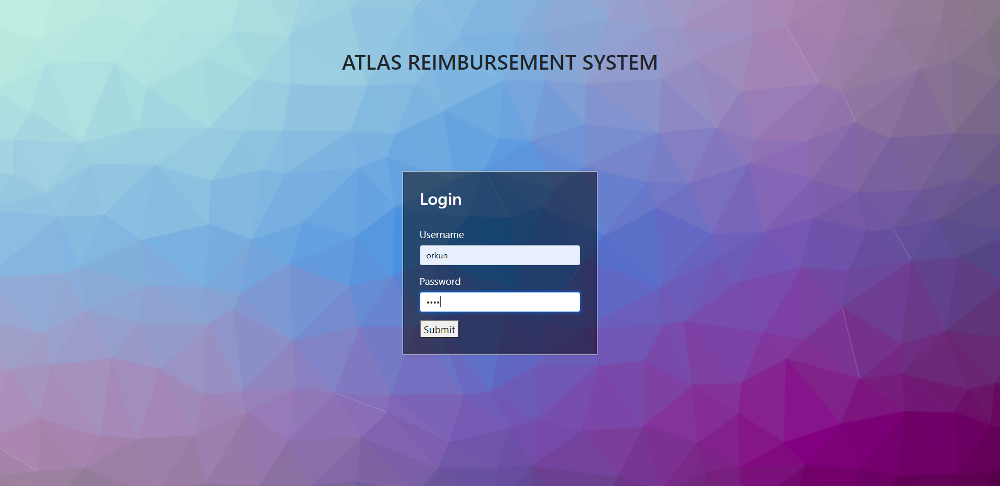
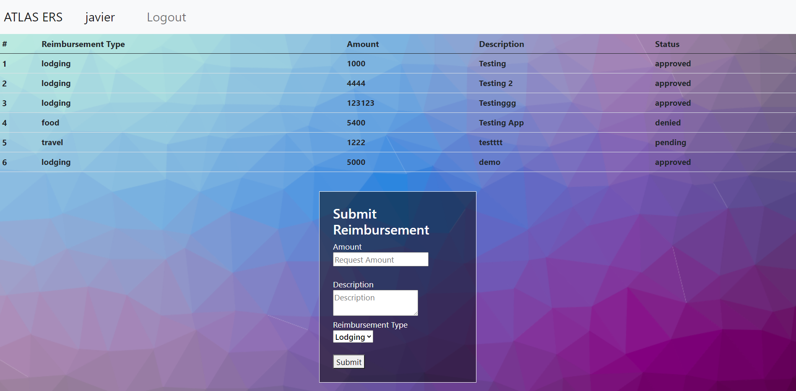
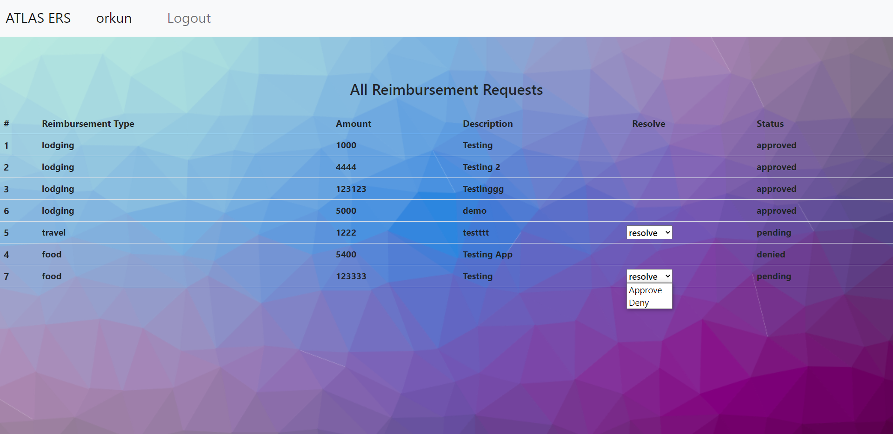

# Atlas Reimbursement System #

Atlas Reimbursement System provides services for managing employees' reimbursement.

## Technologies Utilized ##

<ul>
    <li>Java</li>
    <li>Servlets</li>
    <li>Maven</li>
    <li>AWS RDS</li>
    <li>PostgreSQL</li>
    <li>JavaScript</li>
    <li>HTML</li>
    <li>CSS</li>
    <li>Git</li>
</ul>

## Features ##

<ul>
    <li>As a user, I can login</li>
    <li>As a user, I can logout</li>
</ul>

<ul>
    <li>As an employee, I can see my reimbursement ticket history(pending, approved, denied)</li>
    <li>As an employee, I can submit a new reimbursement request ticket</li>
</ul>

<ul>
    <li>As a finance manager, I can see all employees' reimbursement ticket history(pending, approved, denied)</li>
    <li>As a finance manager, I can resolve reimbursement requests by approval or denial</li>
</ul>

### To-do list for improvement: ###

<ul>
    <li>Style the website with responsive design</li>
    <li>Create a logo for the website</li>
</ul>

## Getting Started ##

<ol>
    <li>git clone https://github.com/orkunozekin/EmployeeReimbursementSystem.git</li>
    <li>Create the below three environment variables (an AWS RDS instance with Postgresql required to connect to the application):</li>
        <ul>
            <li>REVATURE_DB_URL (The URL for your AWS RDS DB instance)</li>
            <li>REVATURE_DB_USERNAME (The username for your AWS RDS DB instance)</li>
            <li>REVATURE_DB_PASSWORD (The password for your AWS RDS DB instance)</li>
        </ul>
    <li>Create a new database instance on an RDBS management application like DBeaver</li>    
    <li>Create the following tables:
        <ul>
            <li>user_roles (
                CREATE TABLE user_roles (
	user_role_id serial PRIMARY KEY 
	, user_role varchar(40) NOT NULL 
);
            )</li>
            <li>reimbursement_type (
                CREATE TABLE reimbursement_type (
	reimb_type_id serial PRIMARY KEY 
	, reimb_type varchar(10) NOT NULL 
);
            )</li>
            <li>reimbursement_status (
                CREATE TABLE reimbursement_status (
	reimb_status_id serial PRIMARY KEY 
	, reimb_status varchar(10) NOT NULL 
);
            )</li>
            <li>users (
                CREATE TABLE users (
	user_id serial PRIMARY KEY 
	, username varchar(50) UNIQUE NOT NULL 
	, PASSWORD varchar(50) NOT NULL 
	, firstname varchar(100) NOT NULL 
	, lastname varchar(100) NOT NULL 
	, email varchar(150) UNIQUE NOT NULL 
	, user_role_id integer NOT NULL 
	, FOREIGN KEY(user_role_id) REFERENCES user_roles(user_role_id) 
);
            )</li>
            <li>reimbursement(
                CREATE TABLE reimbursement (
	reimb_id serial PRIMARY KEY
	, amount integer NOT NULL 
	, submitted TIMESTAMP WITH TIME ZONE DEFAULT CURRENT_TIMESTAMP
	, resolved timestamp
	, description varchar(250)
	, receipt bytea 
	, author integer NOT NULL
	, resolver integer 
	, status_id integer NOT NULL 
	, type_id integer NOT NULL
	, FOREIGN KEY(author) REFERENCES users(user_id)
	, FOREIGN KEY(resolver) REFERENCES users(user_id) 
	, FOREIGN key(status_id) REFERENCES reimbursement_status(reimb_status_id)
	, FOREIGN key(type_id) REFERENCES reimbursement_type(reimb_type_id)
);
            )</li>
        </ul>
    </li>    
    <li>Pre-populate the tables in the database</li>    
    </li>
    <li>Add Apache Tomcat to the Servers in the application's workspace</li>
    <li>Add the application(project) to the Tomcat server</li>
</ol>

## Usage ##  
<ol>
    <li>Login with a user's credential that was pre-populated in the database.</li>
    <li>Depending on the user account type, the app will be redirected to either a Finance Manager's account or an Eomployee's account.</li>
    <li>As an employee, users can see all of their past reimbursement requests and submit a new reimbursement request.</li>
    <li>As a finance manager, users can see all employees' past and currently pending reimbursement request, and resolve it by either denying or accepting the request.</li>
    <li>Both type of account users can logout.</li>
</ol>

## Application In Action:  
  
